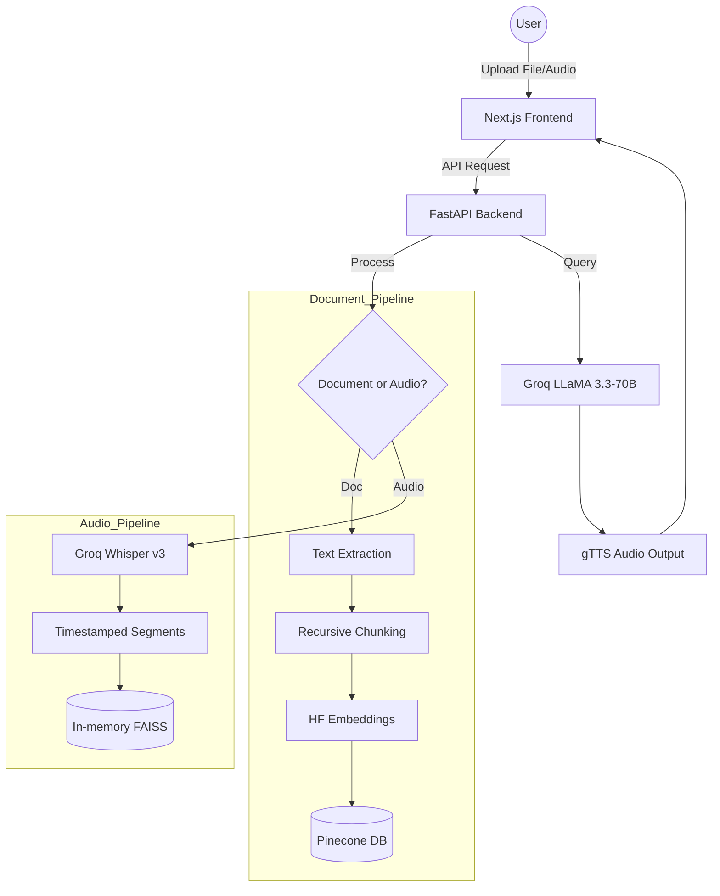
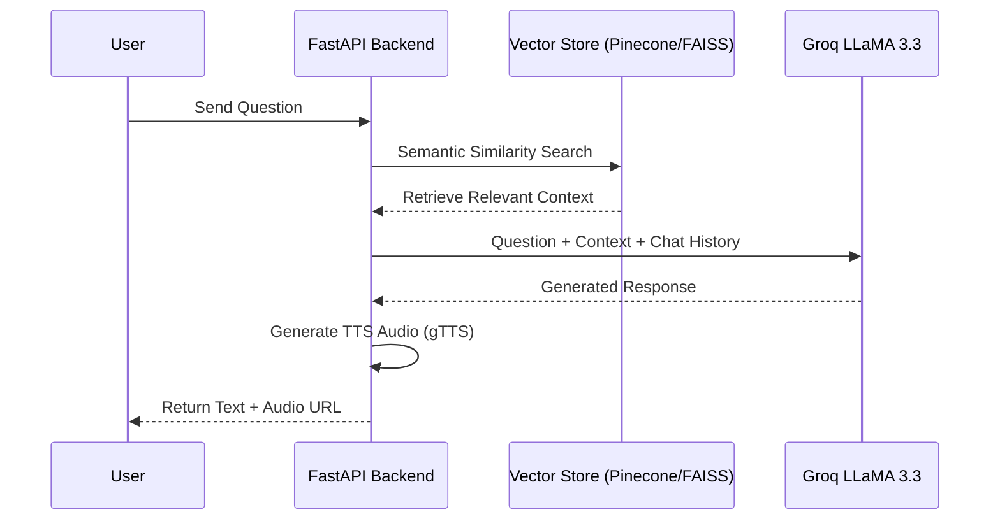

# 🤖 Multi-Modal Multilingual Chatbot (RAG Suite)

A high-performance, professional AI platform for intelligent document interaction, audio processing, and real-time multilingual support.

**🌐 Live Demo:** [https://multimodal-chatbot-multiluinguial.vercel.app/](https://multimodal-chatbot-multiluinguial.vercel.app/)

---

## 🏛️ System Architecture

This project implements two distinct Retrieval-Augmented Generation (RAG) pipelines optimized for different media types.

### 🔄 High-Level Workflow

### 💬 Interaction Flow (Chatting)

### 📄 1. Document RAG Pipeline (Persistence Layer)
The document processing engine is designed for long-term storage and retrieval of text-based information.

1.  **Data Extraction:** Backend utilizes `PyPDF2` (for PDFs), `python-docx` (for Word documents), and standard UTF-8 decoding for TXT files.
2.  **Semantic Chunking:** Text is processed via LangChain's `RecursiveCharacterTextSplitter`. Chunks are optimized at **1000 characters** with a **100-character overlap** to maintain contextual continuity across fragments.
3.  **Vector Embeddings:** We use the `sentence-transformers/all-MiniLM-L6-v2` model from HuggingFace to convert text chunks into **384-dimensional** dense vectors.
4.  **Vector Database (Pinecone):** Embeddings are stored in a serverless **Pinecone** index. To ensure multi-tenant security, each user's data is isolated within a unique `namespace` (e.g., `user_123`).
5.  **Retrieval & Generation:** 
    - Queries are embedded using the same model.
    - `ConversationalRetrievalChain` fetches the top relevant contexts from Pinecone.
    - **LLM:** Groq-hosted `LLaMA 3.3-70B-Versatile` generates human-like responses based on the retrieved context.
6.  **Speech Synthesis:** Responses are converted to audio using `gTTS` (Google Text-to-Speech) for an interactive experience.

### 🎙️ 2. Audio Processing Architecture (Session Layer)
The audio engine focuses on high-fidelity transcription and timestamped interaction.

1.  **Transcription Engine:** Audio files are sent to **Groq Whisper-large-v3** using `verbose_json` response format. This provides word-level precision and segment-level timestamps.
2.  **Automated Summarization:** Before chatting, the system generates a comprehensive summary of the entire transcript using `LLaMA 3.3-70B`.
3.  **Timestamped RAG (FAISS):** 
    - The transcript is broken into time-coded segments (typically 5 segments per block).
    - These segments are indexed in an **in-memory FAISS vector store**.
    - This allows the AI to reference specific moments (e.g., *"[02:15] The speaker discussed the budget..."*).
4.  **Interactive Chat:** Users can ask questions about the audio. The system retrieves the specific timestamped blocks most relevant to the question.

---

## ✨ Key Features

-   **Multi-Modal Support:** Seamlessly switch between querying PDF/DOCX files and Audio/Voice recordings.
-   **Multilingual Intelligence:** Full support for English and Hindi processing (transcription, chat, and synthesis).
-   **Security & Isolation:** JWT-based authentication ensures your documents are only accessible to you via per-user Pinecone namespacing.
-   **Real-time Audio:** Every bot response includes a playable audio version, making it accessible and engaging.
-   **Exportable Insights:** Generate and download summaries and transcripts for your files.

---

## 🛠️ Technology Stack

### **Frontend**
-   **Framework:** Next.js 14 (App Router)
-   **Styling:** Tailwind CSS (Modern "Dark-Neon" Aesthetic)
-   **State Management:** React Hooks
-   **Icons/UI:** Lucide React & Custom Shimmer Components

### **Backend**
-   **API Framework:** FastAPI (Asynchronous Python)
-   **Database:** PostgreSQL (SQLAlchemy ORM)
-   **Vector Search:** Pinecone (Cloud) & FAISS (In-memory)
-   **Inference Engine:** Groq Cloud (LLaMA 3.3 & Whisper-v3)
-   **Embeddings:** HuggingFace Transformers

---

## 🚀 Getting Started

### Prerequisites
-   Python 3.10+
-   Node.js 18+
-   API Keys for: Groq, Pinecone, and Database URL.

### Backend Setup
1.  Navigate to `/backend`
2.  Install dependencies: `pip install -r requirements.txt`
3.  Create a `.env` file with your credentials.
4.  Run the server: `uvicorn main:app --reload`

### Frontend Setup
1.  Navigate to `/frontend`
2.  Install dependencies: `npm install`
3.  Run the dev server: `npm run dev`

---

**designed by divyanshu raj**
